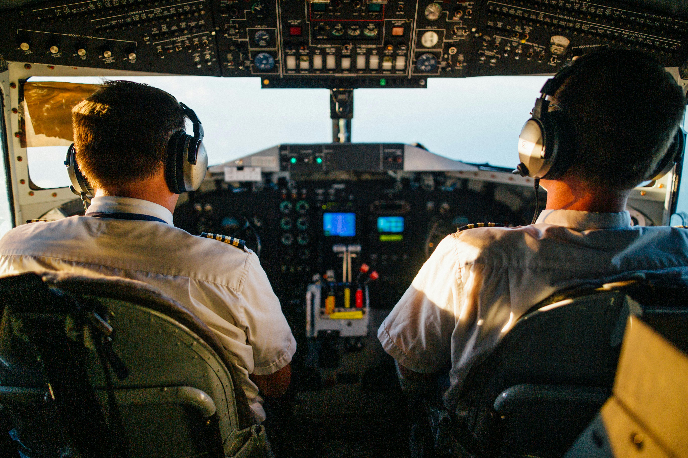

# Aviation-Accident-Database-Synopses -phase 1 project

### I.Overview
This project reviews data from the NTSB aviation accident database contains information from 1962 upto 2023 about civil aviation accidents and selected incidents within the United States, its territories and possessions, and in international waters .As the company expands into new industries, it acknowledges the crucial need to assess and manage the risks linked to aircraft operations. Although the aviation sector is profitable, it involves inherent risks that require careful analysis to ensure well-informed purchasing decisions.

### II.Business Understanding
The company seeks to broaden its portfolio by venturing into the aviation sector, intending to acquire and manage aircraft for both commercial use and private uses. The objective is to pinpoint the aircraft that carry the most risk, thereby ensuring safety through the actions to be taken and reducing potential liabilities. This information will guide the purchasing decisions for the new aviation division, focusing on safety and reliability.

### III.Data Understanding
The dataset includes temporal data with incident dates and information on accident identification from 
[National Transportation Safety Board (NTSB)](http://www.ntsb.gov/)  
[Kaggle NTSB aviation accident dataset](https://www.kaggle.com/datasets/khsamaha/aviation-accident-database-synopses) 
upto *2023* such as distinct event identifiers and inquiry kinds. 

### Methods
This project uses descriptive analysis in several forms to attempt to understand major causes of Aviation Accidents and Various exploratory diagnostis analyses to investigate the correlations between different entries and the region/states thet we're mostly involved in Aviation accidents  
The project also majorly includes various aspects of Data cleaning
* Handling Missing values
* Checking for duplicates
* Fixing structural issues

### Results
 #### Interactive Dashboard
Additional Visualisations and Analysis could be found on Tableau [Martin Kandie Tableau Public](https://public.tableau.com/app/profile/martin.kandie/viz/Personalproject_17183959431240/Dashboard1?publish=yes)
 
Examining the NTSB accident data from the past four decades reveals a noticeable trend of declining fatal accidents and fatalities, highlighting increased air travel safety over the last 40 years ,a significant spike in fatalities may have happened in 2001 due to the tragic 9/11 events

From the next plot we can formulate an understanding on which are the big three makes with the most fatalities
Approximately 26% of fatal accidents involve Cessna aircraft, followed by Piper with 19%, and Beech with 9%.

#### Seeing which Engine types are most involved in Aviation accidents

From the next plot we can then establish that the Make which was "CESSNA" together with the engine type "Reciprocating" was related and they had an inter-relationship by being the leading make and engine types involved in most Aviation incidences rrspectively

We can see That the leading percentage of fatal injuries occur mostly during the VMC or rather(Visual Meteorological Conditions) then followed byIMC (Instrument Meterological Conditions) 
While practically the UNK(Unknown) does not contribute a lot  

The following are the top 10 states with the higest rate of Fatal Accidents

Heatmap showing the density of the states with the most Fatal Accidents

## Conclusions
In conclusion after the thorough investigation i've perfomed through the data preparation and analysis there has been a significant decrease in aviation accidents since 1982 which has been encouraging in the aviation sector, but it's clear that certain states, such as  Texas, Florida and California still experience significantly higher accident rates.  Addressing this issue, it is imperative to continually enhance the safety protocols, regulations, and the procedures in place. Regular reviews and updates of these measures should be given paramount priority so as to stay ahead of emerging risks. In high-accident states, there should be a concerted effort to increase surveillance and regulatory enforcement activities to mitigate the risks associated with aviation accidents.

The majority of Aviation accident incidents occur during favourable weather. Pilots may grow confident in these weather conditions because they believe there are less risks than in the harsher conditions. This can lead to a careless attitude toward safety standards and possibly unsafe activities, such as  flying in low levels and at high speeds while performing  aerobatics, which increase the chances of accidents. It is advised that unsafe behaviours should be discouraged  , it is essential to emphasise the significance of flying within specified safety standards.

Similarly personal flights are responsible for big portion of aviation accidents, for personal flights, comprehensive education and training programs should be promoted for pilots. Insisting on a safety-first culture within the personal aviation community is essentialc,by making safety a top priority in all personal flight activities the reduction of accidents is materialized. Pilots must be well-prepared and aware of the potential risks associated with personal aviation, regardless of the weather conditions and the level of skillset the pilot has thus having a minimal chance  for the possibility of accidents

## Final Recommendations
* #### Enhance Safety Protocols Across All Operations:  
Implement safety protocols all through, regardless of flight purpose or location. Provide ongoing training to enhance risk management and decision-making skills for all crew. Foster a proactive safety culture with incident reporting and continuous learning. 

* #### Invest in Advanced Technology and Infrastructure:  
Upgrade aviation infrastructure, such as airports and runways, to exceed safety standards. Deploy advanced systems for air traffic management, weather monitoring, and decision support to improve situational awareness and operational efficiency. Advocate for regulatory reforms to enforce industry best practices. 

* #### Conduct Regional Safety Assessments and Planning:   
Collaborate closely with local aviation authorities and stakeholders to analyze regional accident data. Develop customized safety plans for high-risk states or regions, focusing on specific risks and effective mitigation strategies. Engage local communities to promote safety initiatives aligned with their priorities. 

* #### Continuous Improvement and Monitoring:  
Regularly conduct safety audits and assessments to monitor effectiveness and identify areas for enhancement. Integrate insights from incidents, case studies, and industry advancements into ongoing training and operational procedures. Stay updated on emerging technologies, regulatory changes, and best practices to continually elevate safety standards and operational practices.

